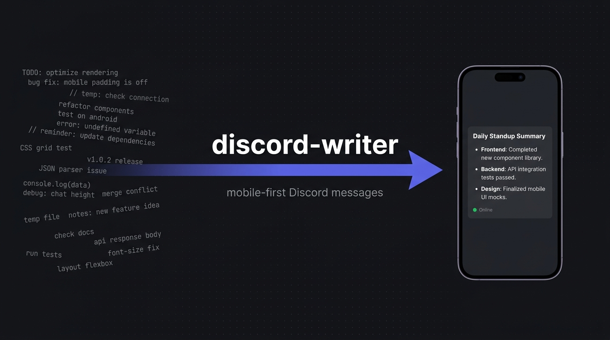

# discord-writer

`discord-writer` is a domain-neutral skill for turning arbitrary content into copy-ready Discord messages.

You paste in rough notes, a changelog, a status dump or a config diff. You get back one block of Discord raw text that you can paste straight into a channel — with the layout chosen from the shape of the information, not from a template.

It focuses on information structure rather than a specific game, product, brand, community, or industry. Domain-specific terminology may come from the current user input or from a user-defined guideline/profile, but never from the base skill itself.

---

## See it in action

Two highlights below. The full **[showcase gallery](showcases/)** has nine, each with the raw input, the exact output and a screenshot of how Discord renders it.

### One post, six formats

Native Markdown, a compact change list, a `diff`, a callout, a timestamped metadata line and a subtext footer — in **one** message.

**You type:**

```text
2.5.0 is out, bulk export is live and sync is automatic now. timeout 30 to 45
seconds. we replaced the manual CSV import with a scheduled bulk export.
first run is tonight, might take an hour. rollout aug 20 19:00. old exports
stay for 30 days.
```

**You paste into Discord:**

````text
# 🚀 Release 2.5.0

Bulk export is live, and sync no longer needs a human.

## Changes

- **Timeout:** `30 s` → `45 s`
- **Sync:** `Manual` → `Automatic`

## Replaced

```diff
- Manual CSV import
+ Scheduled bulk export
```

> ⚠️ **Warning**
> The first run starts tonight and may take an hour.

**Rollout:** <t:1787241600:R>

-# Existing exports stay available for 30 days.
````

Each format was chosen because of what the information *is*, not because it looked good. Note the four outer backticks: the message itself contains three, and this is the transport rule (§ 3) that keeps them alive through copy/paste.

### One layout, two screens

By default you compose for desktop, so a table stays a table:

```text
SERVICE     STATUS   VERSION   LATENCY
API         Online   3.2.1     42 ms
Database    Online   14.6      18 ms
```

Say it has to work on phones, and the same data becomes stacked records — because four columns fit a monitor and destroy a narrow screen:

```text
API
Status:   Online
Version:  3.2.1
Latency:  42 ms

Database
Status:   Online
Version:  14.6
Latency:  18 ms
```

The mobile budget of **≤ 36 visible characters** comes from actual rendering tests. It applies when you ask for it — see [Screen priority](#screen-priority) below.

**→ [Browse all nine showcases](showcases/)**

---

## Using the skill

The skill is a single file: [`SKILL.md`](SKILL.md). Any assistant that can read it can follow it.

**When it activates:** only when Discord is named in your request or clear from context. It deliberately stays out of the way for Discord *bot* and API work (`discord.py`, embed JSON, slash commands), for other platforms, and for general Markdown — see § 0. Once you have established Discord in a conversation, follow-up messages inherit it.

### Claude Code — as a plugin (recommended)

This repository is also a plugin marketplace, so Claude Code can install and update it for you:

```text
/plugin marketplace add gomaaz/discord-writer
/plugin install discord-writer@gomaaz
```

Pull later updates with `/plugin marketplace update gomaaz`.

### Claude Code — manual install

If you would rather not use the plugin system, copy the specification into your skills directory:

```bash
git clone https://github.com/gomaaz/discord-writer.git
mkdir -p ~/.claude/skills/discord-writer
cp discord-writer/SKILL.md ~/.claude/skills/discord-writer/SKILL.md
```

For a single project instead of your whole account, use `.claude/skills/discord-writer/SKILL.md` inside that project.

Either way, you then just ask:

```text
Format this as a Discord announcement: <your notes>
```

### Claude (claude.ai / Desktop)

Create a Project and upload `SKILL.md` to the project knowledge, then put a short line in the project instructions:

```text
When I ask for Discord output, follow SKILL.md from the project knowledge.
```

The specification is ~57 KB, which is why it belongs in project knowledge rather than pasted into an instructions field.

For a one-off message, attaching `SKILL.md` to a single chat works too.

### ChatGPT

**As a custom GPT:** upload `SKILL.md` under **Knowledge** — it is far too long for the instructions field — and put this in **Instructions**:

```text
You format content as Discord messages by following the attached
discord-writer specification (SKILL.md).

Apply it only when the user wants content prepared as a Discord message.
Do not apply it to Discord bot or API development, to other platforms, or
to general Markdown work.

Before writing any Discord message, consult SKILL.md: choose the layout
from the shape of the information, compose for desktop unless the user
asks for a mobile-safe layout, and wrap every finished Discord message in
four backticks so the inner Discord backticks survive copy/paste.

Never invent values, field names, IDs or Unix timestamps that were not
supplied.
```

**In a project or a single chat:** attach `SKILL.md` and open with:

```text
Follow the attached SKILL.md when formatting Discord messages.
Format this as a Discord post: <your notes>
```

### Any other assistant

`SKILL.md` is deliberately vendor-neutral — no Claude-specific or OpenAI-specific requirements. Give the assistant the file and tell it to follow the skill when preparing Discord content.

### Verifying it works

Send this and check the answer:

```text
Format as a Discord post: timeout 30 to 45 seconds, status beta to stable
```

You should get a compact list wrapped in four outer backticks — not a Markdown table, and not a fenced block that has eaten its own backticks.

---

## Configuring the output

The skill has a default look, but you steer it with a **style profile**. Both of these are valid, equivalent input:

```yaml
discord_writer:
  target:
    density: compact
  headings:
    emoji: minimal
  links:
    previews: suppress
```

```text
Discord guideline "internal-tech": technical and terse, few emojis,
mobile-first, values as inline code, no link previews.
```

Profiles control density, emoji style, headings, change styles, links, timestamps, splitting behavior and terminology. Technical correctness is not negotiable by a profile — if a preference would produce unreadable output, the skill switches to a safer layout.

Ready-made starting points: [`templates/GUIDELINE-TEMPLATE.yaml`](templates/GUIDELINE-TEMPLATE.yaml) and [`examples/PROFILE-EXAMPLES.md`](examples/PROFILE-EXAMPLES.md) (Corporate, Technical, Community, Executive).

To have the skill build one for you, ask: `Help me create a Discord style guideline.`

## Screen priority

You write at a keyboard, so the skill composes for a desktop client by default. Structure is preserved: tables stay tables, columns stay columns. Narrowing a layout afterwards is easy — recovering a structure that was already flattened is not.

`target.platform` decides how much narrow screens constrain the layout:

| | `desktop-first` (default) | `balanced` | `mobile-first` |
|---|---|---|---|
| Code block width | ≤ 80 chars | ≤ 48 chars | ≤ 36 chars |
| Logical columns | as many as the data needs | up to 3–4 short ones | 2 |
| A wide table | **kept as a table** | kept when compact | becomes stacked records |

Mobile is deferred, not discarded. You do not need a profile — any of these switches a post, and the rest of the conversation with it:

```text
Make it mobile-friendly.
Our members read this on their phones.
```

And when a post comes out wide enough to break on a phone, you get one short line offering the narrow version. Only then — a compact list or a callout reflows fine anyway, and asking about it would be noise. The skill never converts a delivered post on its own initiative.

What `desktop-first` does **not** unlock: fake syntax highlighting for color, ANSI as an automatic choice, invented columns to fill a table, or exceeding Discord's character limit. Those are correctness rules, not width preferences. Details in [`SKILL.md`](SKILL.md) § 2 and § 2.1.

One thing worth knowing: Discord has no native Markdown table rendering at all. A `| a | b |` row shows up as literal text with pipes. So "keeping a table" always means an aligned monospace code block — the mode only changes how wide it may get.

---

## What it does

- native Discord Markdown for normal posts
- responsive `OLD → NEW` / before-after layouts
- changelog categories
- callouts and status lists
- record layouts for multi-field objects
- `diff` blocks for added/removed content
- Discord timestamps
- masked links and preview suppression
- Unicode checklists
- style profiles / guidelines
- generic content profiles based on information shape
- transport rules that preserve literal Discord backticks when output is generated by an AI chat interface

## Core design principle

The base skill stays generic. It selects a layout from the *shape of the information*:

- normal prose → native Discord Markdown
- short replacements → compact change list
- long replacements → hanging change
- a set of objects with multiple fields → record/component layout
- added/removed items → `diff`
- release changes → changelog categories
- warnings/info/errors → callouts
- status summaries → status list

## Repository layout

```text
discord-writer/
├── SKILL.md
├── .claude-plugin/
│   ├── plugin.json          # plugin manifest
│   └── marketplace.json     # marketplace catalog
├── README.md
├── CLAUDE.md
├── PROJECT_HANDOFF.md
├── CHANGELOG.md
├── GENERICITY.md
├── LICENSE
├── VERSION
├── assets/
│   └── banner.png
├── showcases/
│   ├── README.md            # the gallery
│   ├── CAPTURE-GUIDE.md     # how to produce its screenshots
│   └── images/
├── templates/
│   ├── GUIDELINE-TEMPLATE.yaml
│   └── CONTENT-PROFILE-TEMPLATE.yaml
└── examples/
    ├── PROFILE-EXAMPLES.md
    └── COMPONENT-SET-PROFILE-EXAMPLE.yaml
```

## Working on this repository

This is the contributor path, not the usage path. Open the repository directory in Claude Code and ask Claude to read `CLAUDE.md`, `PROJECT_HANDOFF.md`, and `SKILL.md` before making changes. A suggested first instruction is included in `PROJECT_HANDOFF.md`.

`SKILL.md` is the canonical source of behavior. There is no build step and no test runner; § 18 of `SKILL.md` holds the regression cases R1–R10 that should be re-checked after substantial changes.

## Language

The specification is written in English. That does not determine the output language: Discord messages are written in the user's language. The default labels (changelog categories, callout labels, status wording) are English defaults and should be translated when `language.locale` is a different language, or replaced through a profile.

## Version

Current version: **1.8.1**

## License

MIT — see [LICENSE](LICENSE).
